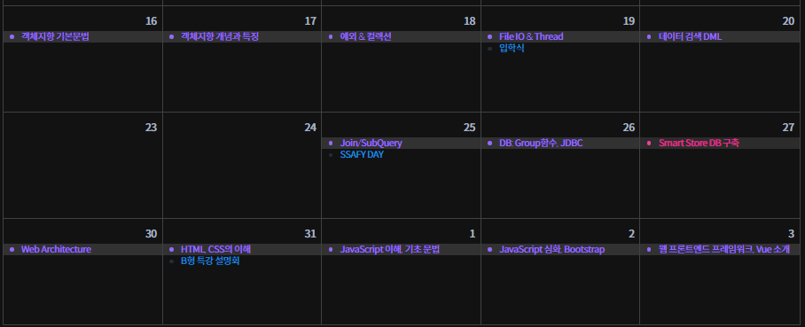
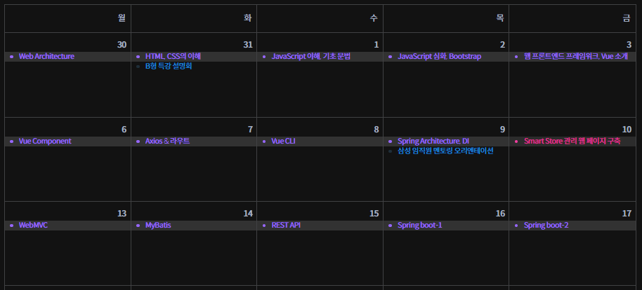
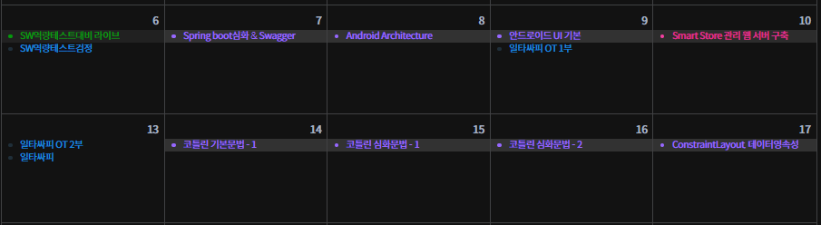
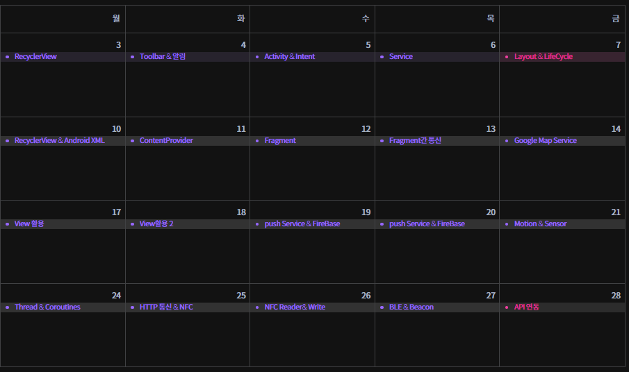

# daily_hw

1. Writing code for others to see
2. Logging code review results
3. Don't write code i don't understand

## Commit Convention
[숙제중] : onGoing homework
[숙제완료] : Finished homework

## Study History

### 1月

`01/16` : OOP Basic
`01/17` : OOP Properties
`01/18` : OOP Exception / Collections
`01/19` : File IO & Thread
`01/20` : MySQL DML
`01/25` : MySQL Join/SubQuery
`01/26` : MySQL_Group_JDBC
`01/27` : PJT(DB)
`01/30` : Web Archiotecture
`01/31` : HTML & CSS

### 2月

`02/01` : JavsScript Basic
`02/02` : JavsScript BootStrap
`02/03` : Vue.js Basic
`02/06` : Vue.js Component
`02/07` : Vue.js Axios & Route
`02/08` : Vue CLi
`02/09` : Spring Architecture, DI
`02/10` : PJT(FE,Vue.js)
`02/13` : Spring webMVC
`02/14` : Spring MyBatis
`02/15` : Spring REST API
`02/16` : Spring-boot Basic 1
`02/17` : Spring-boot Basic 2

### 3月

`03/07` : Spring-boot Swagger
`03/08` : Android Architecture
`03/09` : Kotlin Android UI Basic
`03/10` : Kotlin Basic 1
`03/11` : Kotlin Basic 2
`03/12` : Kotlin Basic 3
`03/17` : Android ConstraintLayout

### 4月

`04/03` : Android RecyclerView
`04/04` : Android ToolBar, Alarm
`04/05` : Android Activity, Intent
`04/06` : Android Service
`04/07` : PJT(Android UI)
`04/10` : Android RecyclerView & Android XML
`04/11` : Android Content Provider
`04/12` : Android Fragment
`04/13` : Android Fragment Request Response
`04/14` : Android Google Map Service
`04/17` : Android View 1
`04/18` : Android View 2
`04/19` : Android Push Service & FireBase 1
`04/20` : Android Push Service & FireBase 2
`04/21` : Android Motion & Sensor
`04/24` : Android Thread & Coroutines
`04/25` : Android HTTP Request & NFC
`04/26` : Android NFC Reader & Write
`04/27` : Android BLE & Beacon
`04/28` : PJT(Android API)

### 5月

`05/01` : Android ViewModel & DataBinding
`05/02` : Android LiveData & Room
`05/03` : Android Compose & SAA
`05/04` : Android Jetpack & Template
`05/08` : PJT(Android Server Connection & Beacon)
`05/09` : Hybrid App
`05/10` : Flutter Dart Basic
`05/11` : Flutter UI
`05/12` : Flutter Routing & Asynchronous
`05/15` : Porting
`05/16` : Build
`05/17` : PJT(Flutter)
`05/18` : Final PJT(...)
